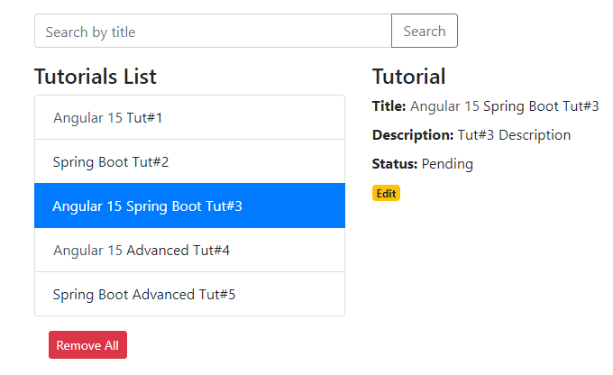

# Spring Boot + Angular 15 + PostgreSQL CRUD example

Full-stack Angular + Spring Boot + PostgreSQL CRUD Tutorial Application in that:
- Each Tutorial has id, title, description, published status.
- We can create, retrieve, update, delete Tutorials.
- We can also find Tutorials by title.



## Run Spring Boot application
```
mvn spring-boot:run
```
The Spring Boot Server will export API at port `8081`.

## Run Angular Client
```
npm install
ng serve --port 8081
```
